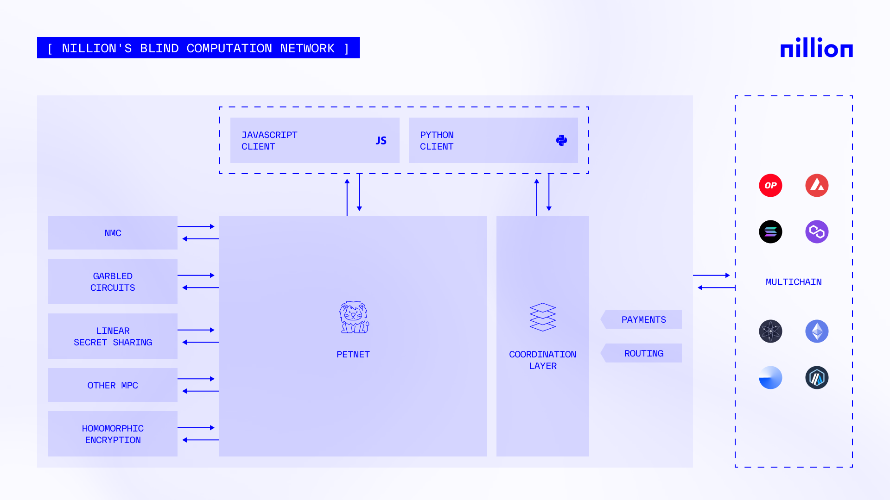

# Nillion Network

We have now established the primitives of MPC, which is cool and all, but what now? 

Nillion claims to have a "Dual Network Architecture", where it splits up the _Coordination Layer_ and the _Petnet (Privacy Enhancing Technology Network)_.

So what are these layers?

## Coordination Layer

From their own description, the coordination layer "coordinates the payment of blind computations and storage operations performed on the network". 

Looking at [the code](https://github.com/NillionNetwork/nilchain) itself, we see that there are functions that enable users to [_pay for resources in the PET network_ ](https://github.com/NillionNetwork/nilchain/blob/2271bbef8e43e897e6c4ad33aed1a2e6adf9221f/proto/nillion/meta/v1/tx.proto#L17). I'm assuming that with this coordination layer, it will pay off nodes in the network involved in the blind computation? There's little information other than the code itself to go off.

## PET Network

The meat of the project should be the PET (Privacy Enhancing Technology) Network, where the MPC actually takes place. We can see in their own diagram that we're (supposedly) not limited to just the novel MPC protocol Nillion has proposed as we find reference to Homomorphic Encryption and Garbled Circuits as well.

You can store **Nada programs** on the Nillion network, which are their equivalent of callable smart contracts. What it means for the program to be "stored" on the network is unclear, especially since it would be overkill and definitely unviable to use the secret sharing scheme on a whole program.

**Secrets**, which is what this whole thing is built off anyways, can also be stored in the network (which presumably is done with a secret sharing scheme like SSS). What is a bit unclear now is whether the secret will be shared across the _entire network_, with all nodes owning a secret share, or whether it'll be stored with only a cluster of nodes.

Also, these nodes performing storage are not under your direct control or supervision. The [Nillion docs ](https://docs.nillion.com/concepts) do speak of **Permissions**, which are access control mechanisms that place CRUD permissions on any secret stored on the network, but it's unclear how this is enforced. 

To cap off, there are four types of nodes that operate in the Nillion network:
- Bootnodes: Meant for bootstrapping of nodes.
- Dealer nodes: "Sends tasks to the Nillion Network".
- Result nodes: Receives results of computations.
- Compute nodes:  Computation and storage. 

Oh, and this network is closed source. 

